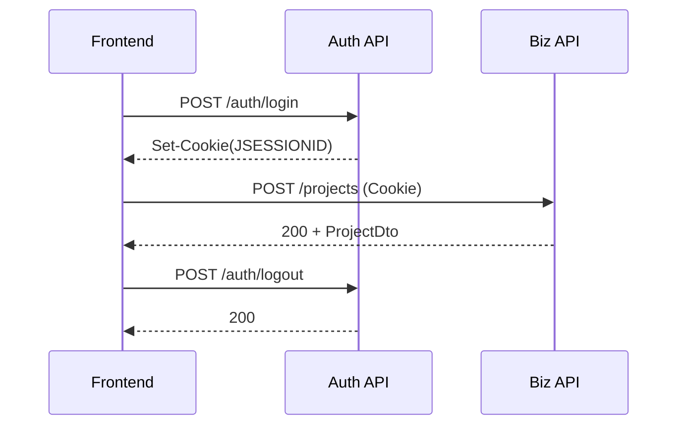

# 区块链实验室后端接口文档（结构化总览）

## 1. 文档元信息

- 文档版本：`1.1.0`
- OpenAPI 版本：`3.0.3`
- 最后更新：`2026-04-17`
- 后端实现基线：`src/main/java/com/dlut/blockchain/controller`
- 规范文件：
  - `docs/openapi.yaml`
  - `docs/openapi.json`

## 2. 环境地址

| 环境 | Base URL |
|---|---|
| 开发 | `http://localhost:8082/api` |
| 测试 | `http://test.blockchain-lab.com:8082/api` |
| 预发 | `http://pre.blockchain-lab.com:8082/api` |
| 生产 | `http://blockchain-lab.com:8082/api` |

## 3. 权限模型说明（务必阅读）

当前 `SecurityConfig` 为 `permitAll`，即技术层没有强制认证拦截；但接口仍存在业务权限约束：

- `POST /auth/login`：建立管理会话。
- 约定“隐藏入口访问”的接口：用于后台管理，不面向公开匿名调用。
- `POST /posts`：代码中显式校验 `HttpSession`，无有效 Session 返回 `401`。

因此，文档中的“权限要求”按两层标注：

- 技术权限：`公开` / `Session(Cookie)`
- 业务权限：`公开可读` / `后台入口`

## 4. 通用请求规范

### 4.1 请求头

| Header | 必填 | 说明 |
|---|---|---|
| `Content-Type: application/json` | JSON 请求时必填 | 提交 JSON 体 |
| `Cookie: JSESSIONID=...` | 会话态写接口建议 | 登录后由服务端下发 |

### 4.2 分页参数（适用于多数列表接口）

| 参数 | 类型 | 默认值 | 说明 |
|---|---|---|---|
| `page` | integer | 0 | 从 0 开始 |
| `size` | integer | 10 或 20 | 每页条数 |
| `sortBy` | string | 见接口默认值 | 排序字段 |
| `sortDirection` | string | `DESC` | `ASC` / `DESC` |

## 5. 响应规范

### 5.1 常见成功响应

- 直接返回 DTO / Page DTO
- 或统一包装 `Result<T>`：

```json
{
  "code": 200,
  "message": "操作成功",
  "data": {},
  "timestamp": 1770000000000
}
```

### 5.2 常见失败响应

- 字段校验失败：`400`
- 会话缺失（部分接口）：`401`
- 资源不存在：`404`
- 运行时异常：`500`

示例：

```json
{
  "code": 500,
  "message": "获取性能统计失败: ...",
  "data": null,
  "timestamp": 1770000000000
}
```

## 6. 数据模型字段约束（核心 DTO）

### 6.1 AuthRequest

| 字段 | 类型 | 必填 | 约束 |
|---|---|---|---|
| `username` | string | 是 | 3-50 |
| `password` | string | 是 | 6-100 |

### 6.2 MemberDto

| 字段 | 类型 | 必填 | 约束 |
|---|---|---|---|
| `studentId` | string | 否 | 8-20 |
| `name` | string | 否 | <=50 |
| `gender` | enum | 否 | `MALE/FEMALE/OTHER` |
| `role` | enum | 否 | `LEADER/VICE_LEADER/SECRETARY/MEMBER` |
| `email` | string | 否 | email |
| `phone` | string | 否 | `^1[3-9]\d{9}$` |
| `status` | enum | 否 | `ACTIVE/INACTIVE/GRADUATED` |

### 6.3 ProjectDto

| 字段 | 类型 | 必填 | 约束 |
|---|---|---|---|
| `name` | string | 否 | <=200 |
| `description` | string | 否 | <=2000 |
| `status` | enum | 否 | `PLANNING/IN_PROGRESS/COMPLETED/CANCELLED/ON_HOLD/ONGOING` |
| `progress` | integer | 否 | 0-100 |
| `budget` | integer | 否 | >=0 |
| `startDate` | date | 否 | `@Future` |
| `endDate` | date | 否 | `@Future` |

### 6.4 PostDto

| 字段 | 类型 | 必填 | 约束 |
|---|---|---|---|
| `title` | string | 是 | <=200 |
| `content` | string | 是 | <=50000 |
| `summary` | string | 否 | <=500 |
| `tags` | string | 否 | <=500 |
| `status` | enum | 否 | `DRAFT/PUBLISHED/ARCHIVED` |

### 6.5 MeetingDto

| 字段 | 类型 | 必填 | 约束 |
|---|---|---|---|
| `title` | string | 是 | <=200 |
| `content` | string | 否 | <=5000 |
| `meetingType` | enum | 否 | `REGULAR/EMERGENCY/PLANNING/REVIEW/TRAINING` |
| `status` | enum | 否 | `SCHEDULED/IN_PROGRESS/COMPLETED/CANCELLED/POSTPONED` |

### 6.6 FileUploadDto

| 字段 | 类型 | 必填 | 约束 |
|---|---|---|---|
| `fileName` | string | 是 | <=255 |
| `originalName` | string | 是 | <=255 |
| `filePath` | string | 是 | 非空 |
| `fileType` | string | 是 | 非空 |

## 7. 接口清单（URL/方法/功能/权限）

> 详细参数与 schema 展开请直接查看 `docs/openapi.yaml`（Swagger/Redoc 已可交互）。

### 7.1 认证

- `POST /auth/login` 管理员登录｜技术权限：公开｜业务权限：后台入口
- `GET /auth/validate` 校验登录状态｜技术权限：公开｜业务权限：会话检查
- `POST /auth/logout` 登出｜技术权限：公开｜业务权限：会话结束

### 7.2 成员

- `GET /members`
- `GET /members/active`
- `GET /members/featured`
- `GET /members/{id}`
- `GET /members/student/{studentId}`
- `GET /members/role/{role}`
- `GET /members/grade/{grade}`
- `GET /members/search?keyword=`
- `POST /members`
- `PUT /members/{id}`
- `DELETE /members/{id}`
- `PATCH /members/{id}/status`
- `PATCH /members/{id}/display-order`

### 7.3 项目

- `GET /projects`
- `GET /projects/public`
- `GET /projects/featured`
- `GET /projects/ongoing`
- `GET /projects/completed`
- `GET /projects/{id}`
- `GET /projects/status/{status}`
- `GET /projects/category/{category}`
- `GET /projects/search?keyword=`
- `GET /projects/date-range?startDate=&endDate=`
- `GET /projects/budget-range?minBudget=&maxBudget=`
- `GET /projects/progress-range?minProgress=&maxProgress=`
- `POST /projects`
- `PUT /projects/{id}`
- `DELETE /projects/{id}`
- `PATCH /projects/{id}/status`
- `PATCH /projects/{id}/progress`
- `PATCH /projects/{id}/display-order`

### 7.4 文章

- `GET /posts`
- `GET /posts/featured`
- `GET /posts/latest?limit=`
- `GET /posts/{id}`
- `GET /posts/status/{status}`
- `GET /posts/search?keyword=`
- `GET /posts/tag/{tag}`
- `POST /posts`
- `PUT /posts/{id}`
- `DELETE /posts/{id}`
- `PATCH /posts/{id}/status`
- `POST /posts/{id}/like`
- `DELETE /posts/{id}/like`
- `PATCH /posts/{id}/display-order`
- `GET /posts/statistics`

### 7.5 例会

- `GET /meetings`
- `GET /meetings/completed`
- `GET /meetings/upcoming`
- `GET /meetings/{id}`
- `GET /meetings/status/{status}`
- `GET /meetings/type/{type}`
- `GET /meetings/search?keyword=`
- `POST /meetings`
- `PUT /meetings/{id}`
- `DELETE /meetings/{id}`
- `PATCH /meetings/{id}/status`
- `PATCH /meetings/{id}/display-order`
- `GET /meetings/statistics`

### 7.6 文件

- `POST /files/upload`（multipart/form-data）
- `GET /files/download/{fileName}`
- `GET /files`
- `GET /files/{id}`
- `GET /files/name/{fileName}`
- `GET /files/category/{category}`
- `GET /files/search?keyword=`
- `PUT /files/{id}`
- `DELETE /files/{id}`
- `GET /files/statistics`

### 7.7 统计

- `GET /stats/overview`
- `GET /stats/users`
- `GET /stats/content`
- `GET /stats/trends?days=`
- `GET /stats/activity`
- `GET /stats/categories`
- `GET /stats/files`
- `GET /stats/range?startDate=&endDate=`
- `GET /stats/realtime`
- `GET /stats/export`

### 7.8 缓存

- `DELETE /cache/clear-all`
- `DELETE /cache/clear/{cacheName}`
- `GET /cache/names`

### 7.9 性能

- `GET /performance/stats`
- `GET /performance/metrics/api`
- `GET /performance/metrics/database`
- `GET /performance/metrics/system`
- `GET /performance/metrics/all`

### 7.10 访问统计

- `GET /visit-stats/overview`
- `GET /visit-stats/trend?days=`
- `GET /visit-stats/devices?startDate=&endDate=`
- `GET /visit-stats/browsers?startDate=&endDate=`
- `GET /visit-stats/traffic-sources?startDate=&endDate=`
- `GET /visit-stats/top-pages?startDate=&endDate=&limit=`
- `GET /visit-stats/performance?startDate=&endDate=`
- `GET /visit-stats/realtime`

## 8. 请求/响应示例（正常 + 异常）

### 8.1 登录成功

```json
{
  "username": "admin",
  "password": "123456"
}
```

```json
{
  "accessToken": "admin_session",
  "refreshToken": "",
  "tokenType": "Bearer",
  "expiresIn": 3600000,
  "username": "admin",
  "role": "ADMIN"
}
```

### 8.2 创建文章（无 Session，异常）

```http
POST /api/posts
Cookie: (缺失)
```

```json
null
```

状态码：`401`

### 8.3 访问趋势（参数越界，异常）

`GET /api/visit-stats/trend?days=999`

```json
{
  "error": "天数必须在1-365之间"
}
```

状态码：`400`

## 9. 调用顺序与时序图



## 10. 变更与废弃

- 变更记录：`docs/site/docs/changelog.md`
- 废弃策略：`docs/site/docs/deprecation-policy.md`
- 当前废弃接口：无

## 11. 在线文档与导入链接

- Swagger UI：`/swagger/`
- Redoc：`/redoc/`
- Postman 集合：`/postman/blockchain-backend.postman_collection.json`

## 12. CI 自动化

已提供：

- OpenAPI 校验与 JSON 生成
- Docusaurus 静态站点构建
- GitHub Pages 自动部署

配置文件见：`.github/workflows/docs-publish.yml`
