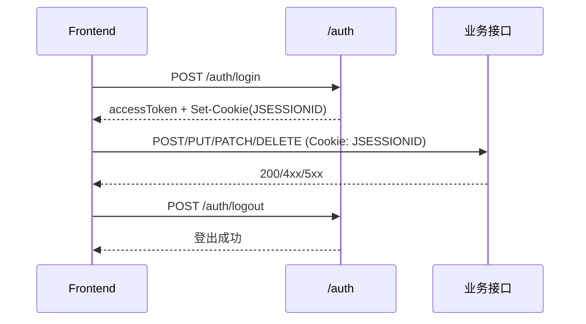

# 接口依赖与幂等性

## 调用顺序

## 依赖关系

- `POST /auth/login` 是会话态写接口的前置步骤。
- `POST /posts` 在代码中显式校验 Session，无 Session 返回 401。
- 统计接口依赖成员/项目/文章/例会/文件数据完整性。
- 访问统计接口依赖访问日志持续写入。

## 幂等性说明

- 幂等：`GET`、`PUT`、`DELETE`、`PATCH /{id}/status`、`PATCH /{id}/display-order`。
- 非幂等：`POST` 创建类接口、`POST /posts/{id}/like`、`DELETE /posts/{id}/like`（对计数有副作用）。
- 文件下载接口 `GET /files/download/{fileName}` 会增加下载计数，严格来说非幂等。

## 重试建议

- 幂等接口可在网络错误时安全重试。
- 非幂等接口建议使用请求幂等键（客户端生成）避免重复提交。
